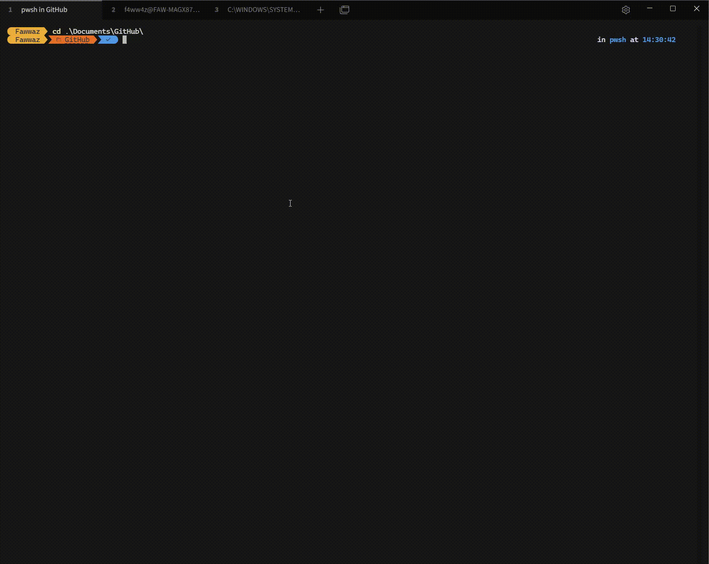

# tabby-mru



Browser-style **Most Recently Used (MRU)** tab switching for the [Tabby terminal](https://tabby.sh), with a visual popup.

Hold `Ctrl` and press `Tab` to cycle through your recent tabs — a centered popup
shows the list, and releasing `Ctrl` commits the selection. Just like Chrome, Edge,
or Firefox.

## How it works

1. **Hold `Ctrl` + press `Tab`** — a "Recent tabs" popup appears, highlighting the
   most recently used tab.
2. **Keep pressing `Tab` (still holding `Ctrl`)** — the highlight advances through
   the MRU list. Each press cycles one step forward, wrapping around.
3. **Release `Ctrl`** — the highlighted tab is selected instantly. No delay.
4. **Press `Escape`** while cycling — cancels and returns to the original tab.

## Important: Hotkey conflict avoidance

> **Do NOT bind `Ctrl+Tab` or `Ctrl+Shift+Tab` to any action in Tabby's
> Settings > Hotkeys.** This plugin intercepts `Ctrl+Tab` directly at the
> document level. If you also bind it in Tabby's settings, the two will
> conflict and behaviour will be unpredictable.

## Configuration

You can customise the maximum number of tabs shown in the popup by adding
this to your Tabby config file (`%APPDATA%\tabby\config.yaml` on Windows,
`~/.config/tabby/config.yaml` on Linux, or `~/Library/Application Support/tabby/config.yaml` on macOS):

```yaml
mru:
  maxEntries: 8   # default is 10
```

## Project layout

```
tabby-mru/
├── package.json
├── tsconfig.json
├── webpack.config.js
└── src/
    ├── index.ts              # NgModule entry point
    ├── mru.service.ts        # MRU stack tracking + keyboard handling + popup lifecycle
    ├── mru-popup.component.ts # Visual popup overlay component
    └── config.ts             # ConfigProvider — default settings
```

## 1. Local setup

```bash
npm install
```

`tabby-core` only needs to be present at compile time — Tabby supplies it at
runtime — which is why it's under `peerDependencies` and listed in
`externals` in `webpack.config.js`.

## 2. Build

```bash
npm run build
```

This produces `dist/index.js` + `dist/index.d.ts` + a source map. That
`dist/` folder plus `package.json` is the actual plugin Tabby loads.

## 3. Test locally before publishing

Tabby loads plugins from a `plugins/node_modules/<name>` folder inside its
config directory:

- Linux: `~/.config/tabby/plugins/node_modules/`
- macOS: `~/Library/Application Support/tabby/plugins/node_modules/`
- Windows: `%APPDATA%\tabby\plugins\node_modules\`

Steps:

1. `mkdir -p ~/.config/tabby/plugins/node_modules/tabby-mru`
2. `cp -r package.json dist ~/.config/tabby/plugins/node_modules/tabby-mru/`
3. Fully quit and relaunch Tabby (not just close the window — plugins load at startup).
4. Open **Settings > Plugins** and confirm `tabby-mru` shows as installed.
5. Open several tabs, switch between non-adjacent ones normally, then hold
   `Ctrl` and press `Tab` — the popup should appear and cycle through your
   usage order, not tab-bar position.
6. **Make sure `Ctrl+Tab` is NOT bound to anything** in Settings > Hotkeys.

While developing, run `npm run watch` and relaunch Tabby after each change —
plugin code isn't hot-reloaded.

## 4. Publish to npm (so it's installable from Tabby's Plugin manager)

Tabby's Settings > Plugins tab discovers community plugins by searching npm
for the `tabby-plugin` keyword, which is already set in `package.json`.

1. `npm adduser` (skip if you already have an npm account)
2. Confirm in `package.json`: unique `name`, correct `version`,
   `keywords: ["tabby-plugin"]`, real `author`/`license`, and `files: ["dist"]`
   so only the build output ships.
3. Sanity check exactly what will be published: `npm publish --dry-run`
4. Publish: `npm publish`
5. In Tabby, go to **Settings > Plugins**, search `mru`, and install it like
   any other community plugin to confirm the listing works end to end.

## Notes and limitations

- Selection is committed the instant you release the `Ctrl` key — no timers,
  no delays, no debouncing. Press `Escape` to cancel.
- The MRU stack is filtered against open tabs on every cycle, so closed or
  reordered tabs never produce a stale jump target.
- This only changes keyboard-driven selection order — your tab bar layout
  and tab positions are untouched.
